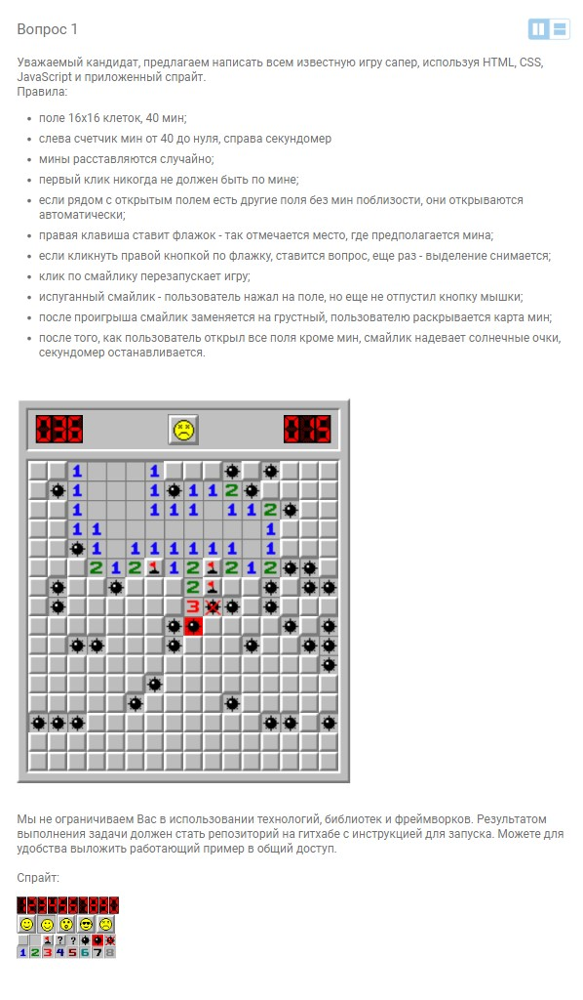

# Minesweeper

## Author: [Anton Fomichev](https://github.com/fluxionbeats)

Demo: [github-pages](https://fluxionbeats.github.io/minesweeper-ts-2023/)

## Task



## Getting started

In the project directory, you can run:

### `npm install`

Collecting all the necessary packages.

### `npm start`

Runs the app in the development mode.\
Open [http://localhost:3000](http://localhost:3000) to view it in the browser.

The page will reload if you make edits.\
You will also see any lint errors in the console.

### `npm run build`

Builds the app for production to the `build` folder.\
It correctly bundles React in production mode and optimizes the build for the best performance.

The build is minified and the filenames include the hashes.\
Your app is ready to be deployed!

See the section about [deployment](https://facebook.github.io/create-react-app/docs/deployment) for more information.

## Dependencies

```bash
├── @reduxjs/toolkit@1.9.3
├── @types/node@16.18.14
├── @types/react-dom@18.0.11
├── @types/react@18.0.28
├── @typescript-eslint/eslint-plugin@5.54.0
├── @typescript-eslint/parser@5.54.0
├── classnames@2.3.2
├── eslint-config-prettier@8.6.0
├── eslint-plugin-prettier@4.2.1
├── eslint-plugin-react-hooks@4.6.0
├── eslint-plugin-react@7.32.2
├── eslint@8.35.0
├── gh-pages@5.0.0
├── prettier@2.8.4
├── react-dom@18.2.0
├── react-id-generator@3.0.2
├── react-redux@8.0.5
├── react-scripts@5.0.1
├── react@18.2.0
├── redux@4.2.1
├── reset-css@5.0.1
├── sass@1.58.3
└── typescript@4.9.5
```

## Documentation files

```bash
.
├── Readme.md
├── public
│   └── Readme.md
└── src
    ├── Readme.md
    ├── assets
    ├── components
    │   ├── App
    │   ├── Board
    │   ├── Bombs
    │   ├── Cell
    │   ├── Display
    │   ├── Face
    │   ├── Field
    │   ├── Header
    │   ├── Readme.md
    │   └── Stopwatch
    ├── hooks
    │   └── Readme.md
    ├── store
    │   └── Readme.md
    ├── styles
    │   └── Readme.md
    └── types
        └── Readme.md
```

## Learn More

You can learn more in the [Create React App documentation](https://facebook.github.io/create-react-app/docs/getting-started).

To learn React, check out the [React documentation](https://reactjs.org/).
