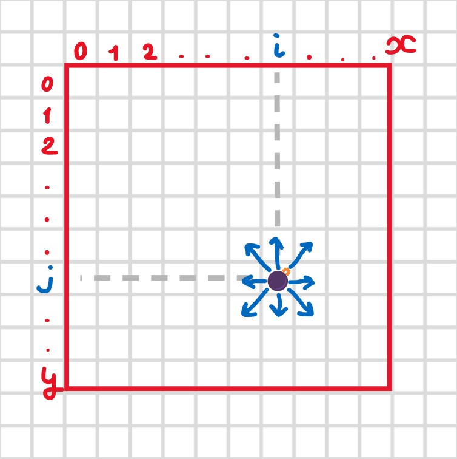

# src

The realization of the game.

## Main algorithm

The realization of minesweeper algorithm is implemented in `game.ts`.\
Minesweeper main algorithm realization:

1. Bombs are randomly generated in the `generateBombs` function
2. Field is randomly generated in the `generateField` function (requires an array of bombs as a parameter)
   First, filling the field with zeros, then, iterating through bombs array, increment the value of neighbour cells.
   \
    
